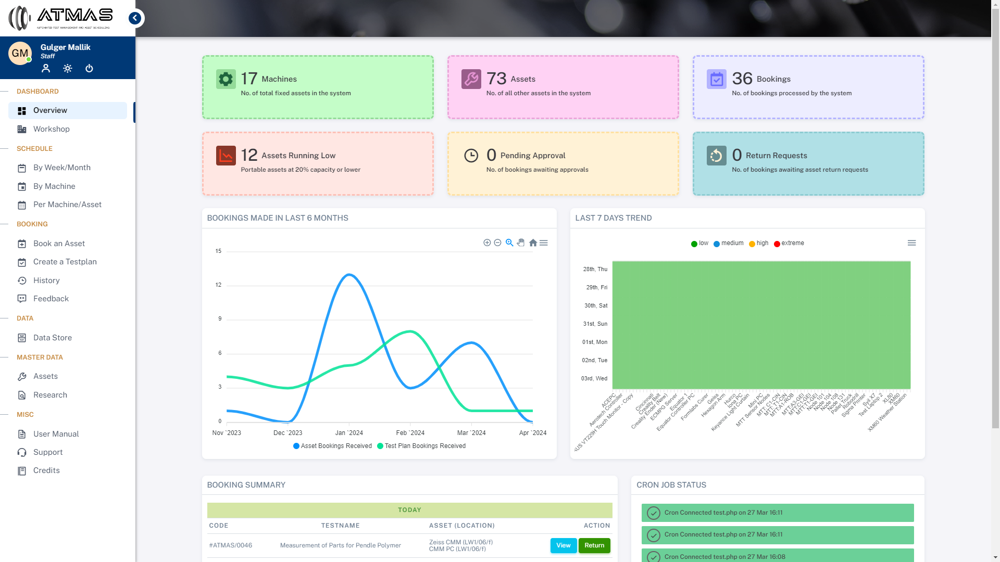
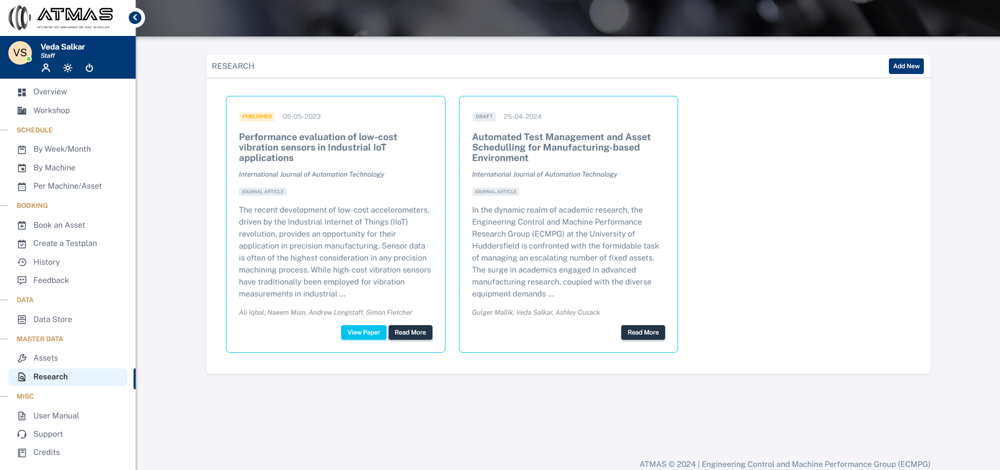

# ATMAS

  

ATMAS addresses significant challenges in scheduling processes and test plan submissions by replacing existing paper\-based/SharePoint systems and email exchanges. The old systems led to delays, errors, and suboptimal resource allocation. ATMAS provides a streamlined, web\-based solution for efficient asset management and test plan scheduling.
 
An asset management and scheduling system for internal use by the Engineering Control and Machine Performance Group (ECMPG) at the University of Huddersfield.

Index of Content:
* [About ATMAS](#introduction)
* [Getting started](#getting-started)
* [Booking an asset](#booking-an-asset)
* [Making a test plan](#making-a-test-plan)
* [Collecting of your asset(s)](#collecting-of-your-assets)
* [Performing your test](#performing-your-test)
* [Returning of your asset(s)](#returning-of-your-assets)
* [Completing your booking](#completing-your-booking)
* [Viewing schedule](#viewing-schedule)
* [Workshop view](#workshop-view)
* [Looking up historical booking](#looking-up-historical-booking)
* [Rescheduling a booking](#rescheduling-a-booking)
* [Re\-run/copy a booking](#reruncopy-a-booking)
* [Proving Feedback for a booking](#proving-feedback-for-a-booking)
* [Viewing assets](#viewing-assets)
* [Adding research work](#adding-research-work)
* [Requesting sensor data](#requesting-sensor-data)
* [Changing password](#changing-password)
* [Help and support](#help-and-support)

##### Advantages of ATMAS:

* Efficiency: Streamlined processes and minimized manual errors.
* Informed Decision\-Making: Real\-time data for better resource allocation.
* Organized Inventory: Easy tracking and management of assets.
* User\-Friendly: Convenient and intuitive interface.

##### Technology Stack:

* Frontend: HTML, CSS, and JavaScript for an interactive and visually appealing UI.
* Backend: PHP for robust functionality.
* Database: MySQL for efficient data management.
* Architecture: MVC (Model\-View\-Controller) for organized code structure.

##### Project Outcomes:

* Problem\-Solving Skills: Enhanced through collaborative efforts.
* Project Management: Improved ability to manage and deliver projects.
* Communication and Collaboration: Importance of clear communication and efficient teamwork.
* Adaptability: Ability to adapt to challenges and new learning experience
* Professional Growth: Deepened understanding of software development and commitment to continuous improvement.

### Getting started

###### User Login:

###### Dashboard:

###### Forgot Password:

  

###### Change Theme

 The system supports both light and dark themes. You can switch between them according to your preference.
 

### Booking an asset

###### Fill your request form

 To book an asset, navigate to the Menu and select *Book an Asset*. Upon clicking this option, a form will appear.
   

 This form includes basic details of your requirement.
   

  

### Making a test plan

 This is a three\-step process that enables you to generate a test plan directly from the system. You can then print it as a PDF or Word document format, allowing you to make further edits as needed. This streamlines the test plan creation process and saves a significant amount of manual work.
 

###### Step 1: Fill your request form

1. Fill in the basic details of your requirement. If you are unsure of anything, please consult your supervisor or applications engineer before submitting a request.  

2. Once you have selected the assets you require, any dependencies of the asset will be automatically selected by the system. You will have the option to remove any *optional* dependencies.   

3. The start and end dates will be available for selection based on the availability of all selected assets.   

4. Upload any diagrams or files relevant to your request.
5. Select any preferred sensor data, which will be provided to you once the test is completed.
6. Select the period of data recording required if you need specific data during your ongoing test.   

###### Step 2: Add your test parameters

1. This step allows you to include stages/sections for your experiment or test plan.
2. You can add multiple sections and multiple variables to your test plan.
3. If your variable is not present in the variables list, you can use the *\+ Add Custom Variable* option from the dropdown. This will provide you with an input field to add your variable name and its respective values.  

4. You can select different types of variables and add respective values for your experiment. For example, you could select "Feed Rate" as your variable with values 100, 200, 300\.   

###### Step 3: Verify and submit generated test plan

 At this step, you can preview your generated test plan and download it as a PDF or Word document for review. Once you are satisfied with the generated test plan, you are required to submit it to proceed with your request.  

### Collecting of your asset(s)

 Once your booking has been approved, you must collect all your portable assets from the store room in the workshop. To do so, scan your staff card and then scan each listed asset for collection. It's essential to complete this step; otherwise, you will **not be able to proceed with your test**.
 

### Performing your test

 The system allows you to capture textual notes for every test being conducted. You can also upload associated data files for specific data uploads. Please ensure that you adhere to the file naming structure to successfully upload the file to the designated area.
   
  

 During the test, you have the flexibility to repeat, delete, or update the values of your variables as needed.
   
  

 Once you have completed your test, remember to click the "Finish Test" button to finalize the process.
 

### Returning of your asset(s)

 Once you have finished your test, ensure to return the asset to its original location, which is the store room. To complete the return process, scan your staff ID card and then scan the portable asset codes to confirm their presence.
   
  

 If any asset requires authorization from the applications engineer, you will be notified accordingly. The return of the asset can only proceed once the applications engineer has approved it.
   
  

### Completing your booking

 Once the assets have been returned and any required verification is completed, you can mark your test as complete. Please note that once the test is marked as complete, you will not be able to make any further changes to your test plan.
 

### Viewing schedule

###### Week/Month Schedule

 To access the calendar overview of all scheduled bookings, navigate to *By Week/Month* from the menu. This view allows you to toggle between dates, months, weeks, days, and a list of bookings. Clicking on any scheduled event will display more details about it.
 

###### Daily Schedule for Machine

 To view the daily schedule for a specific machine, navigate to *By Machine* from the menu. This view presents a block view of bookings occurring on a particular machine for a specific day. Clicking on a booking will reveal more details if it belongs to you.
 

###### Machine Schedule for Next 2 Weeks

 To see the schedule for any selected machine for the next two weeks, navigate to *Per Machine/Asset* from the menu. Here, you'll find a block view of bookings for the chosen machine.
 

### Workshop view

 To access the list of bookings on every machine and navigate through different days, go to *Workshop* in the menu. Here, you can view bookings for various machines and check dates in both the future and the past.
 

### Looking up historical booking

 To view all your old bookings, navigate to *History* from the menu.
 

###### My Bookings

 Clicking the "My Bookings" button on the top right of the page will filter the list to show only the bookings made by you.
 

###### All Bookings

 Clicking the "All Bookings" button on the top right of the page will filter the list to show all bookings made by you and others that have been completed. This can be useful for reference or if you want to duplicate a previous booking made by someone else.
 

###### Search Booking

 Clicking the "Search" button on the top provides advanced search options to help you narrow down the list to specific bookings you are looking for.
 

###### Frequently Repeated Test (FRT)

 Clicking the "FRT" button shows any frequently repeated tests existing in the system. These can serve as a starting point for conducting a test.
 

### Rescheduling a booking

 You can reschedule your booking at any time before its start date if you anticipate not being able to conduct the test as planned. However, in such cases, approval from the applications engineer is mandatory.
 

### Re\-run/copy a booking

 You have the option to re\-run or copy any previous test or booking, whether it was created by you or someone else. However, in the latter case, the booking must be completed for you to re\-run or copy it. This feature will transfer all the necessary assets, test parameters, and variables from the old booking into the new one assigned under your name. This saves you time and effort by avoiding the need to recreate past bookings from scratch.
 

### Proving Feedback for a booking

 After completing your booking, you can provide feedback about it in your booking history. This is an opportunity for you to share your experience or provide information about the state of the equipment. Feel free to report any damage or problems you encountered with the equipment during your booking.
 

### Viewing assets

 To view the list of assets, navigate to *Assets* from the menu. 
 

 You can also access more details about a specific asset by clicking on the  icon. This will provide you with basic asset details, its dependencies, all associated test plans, and any associated research papers.
 

### Adding research work

 To add your research work, navigate to *Research* from the menu. 
 

 Additionally, you can link your research with the test plans that facilitated its completion.
 

### Requesting sensor data

 In addition to retrieving data for your tests conducted through ATMAS, you can also request specific sensor data based on a machine, workshop, or any other criteria directly through ATMAS. There are four types of data gathering processes occurring in the workshop, aside from ATMAS recording which you can access by navigating to *Data Store* from the menu. These are explained below.
 

###### Summary Data

Provides summarized data from sensors on the machine(s) in the workshop.
 

###### Workshop Data

Offers data from sensors positioned around the workshop and specific data points (e.g., humidity, temperature, etc.).
 

###### Loop Recording

Captures data from all sensors of a particular machine continuously.
 

###### Manual Recording

Records data manually from all sensors of a particular machine.
 

###### ATMAS Recording

Gathers data during tests conducted using ATMAS.

### Changing password

 You can update your password, staff number, and office location from your profile section. It's highly recommended that you periodically change your password for security reasons.
 

